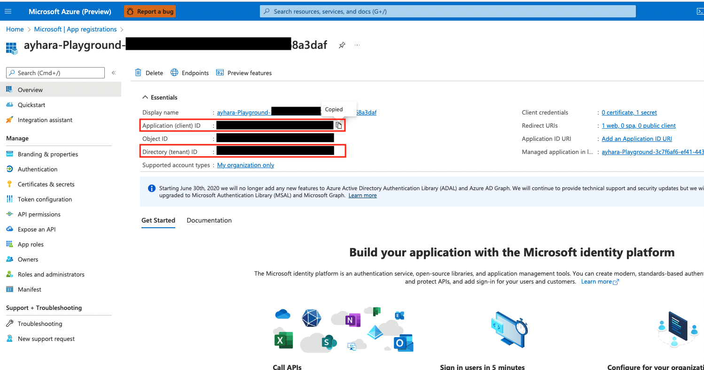

# Azure DevOps project to deploy DACPAC with Always Encrypted
This is Azure DevOps project sample to build and deploy DACPAC with Azure SQL Server Always Encrypted*.

*Always Encrypted is a feature included in Azure SQL Server. Data is encrypted all the time, not only at rest but also in motion. Furthermore, the encryption keys which are essential for both encrypting and decrypting are not stored in the database.
For more information on Always Encrypted, please refer to [the official documentation](https://docs.microsoft.com/en-us/sql/relational-databases/security/encryption/always-encrypted-database-engine?view=sql-server-ver16).


The following steps will be executed in the pipeline:
1. Build DACPAC
2. Deploy DACPAC
3. Add Sample Data
4. Create CMK and CEK in Kay Vault and DB
5. Encrypt selected columns

## Pre-requisites

1. Create Azure resources
2. Create Azure DevOps project
3. Create Service connection
4. Create variable group
5. Configure YAML pipeline

### 1. Create Azure resources

Go to the Azure portal and create required resources in a resource group:
- SQL Server
- SQL Database
- Key Vault

Also, the following resources are required:
- [Azure Account](https://azure.microsoft.com/en-us/free/)
- [Azure DevOps](https://azure.microsoft.com/en-us/services/devops/)

### 2. Create Azure DevOps project

Create a new project in Azure DevOps by following [this document](https://docs.microsoft.com/en-us/azure/devops/organizations/projects/create-project?view=azure-devops&tabs=preview-page&viewFallbackFrom=vsts). You can also import this GitHub repository easily. Please refer to [here](https://docs.microsoft.com/en-us/azure/devops/repos/git/import-git-repository?view=azure-devops).

### 3. Create Service connection

Create [a Service connection](https://docs.microsoft.com/en-us/azure/devops/pipelines/library/service-endpoints?view=azure-devops&tabs=yaml) which is required to access the resources in the resource group from Azure DevOps. 

1. Sign in to your organization (https://dev.azure.com/{yourorganization}) and select your project.
2. Select Project settings > Service connections.
3. Select + New service connection, select the type of service connection that you need, and then select Next.
4. Choose an authentication method, and then select Next.
5. Enter the parameters for the service connection. The list of parameters differs for each type of service connection. For more information, see the list of service connection types and associated parameters.
6. Select Save to create the connection.

### 4. Create variable group
Create variable group in Library under Pipelines and add the following variables:
- Variable group name : iac-deploy-variables
    - clientId
    - clientSecret
    - SQLPASSWORD
    - SQLUSER
    - tenantId


#### Where you can find `cliendId` and `tenantId`
Go to Azure portal and search for your service principal for Azure DevOps in your App Registration page.



#### Where you can find `clientSecret`
Create a Secret for the Service Principal and copy the secret.


### 5. Configure YAML pipeline

Change the following variables in `sql-deployment-template.yml` to your own values.

```
variables:
- name: AzureSvcName
  value: AyharaSampleConnectionService # Change your own Service Connection name
- group: iac-deploy-variables
- name: SqlServerName
  value: sql-ayhara-sample # Change your own SQL Server name
- name: SqlDatabaseName
  value: sqldb-ayhara-sample-ado # Change your own SQL DB name
- name: resourceGroup
  value: rg-ayhara-playground # Change your own resource group name
- name: akvName
  value: kv-ayhara-sample-ado # Change your own Key Vault name
```

Then go to Pipelines in your DevOps and then click “New pipeline”. Go to the wizard, select the Azure Repos Git and the repository, and choose “Existing Azure Pipelines YAML file” which is `sql-deployment-template.yml`.

## Check the result

Once pipeline run is completed, please check the result by querying a table with encrypted field.


